# Core Folder Dependency Diagram

Here's a dependency diagram showing the relationships between files in the `src/core` folder:

```mermaid
graph TB
    %% Types Layer (Base Dependencies)
    subgraph "types/"
        OT[operation.types.ts]
        AT[adapter.types.ts]
        QT[query.types.ts]
        HT[handler.types.ts]
    end

    %% Utils Layer
    subgraph "utils/"
        SI[schema-inspector.ts]
        EH[error-handler.ts]
        FB[filter-builder.ts]
        EB[embed-builder.ts]
        QP[query-parser.ts]
        QB[query-builder.ts]
        SIT[schema-inspector.test.ts]
    end

    %% Actions Layer
    subgraph "actions/"
        BA[base-action.ts]
        AI[index.ts]
        CR[create.ts]
        DE[delete.ts]
        GM[get-many.ts]
        GO[get-one.ts]
        RE[replace.ts]
        UP[update.ts]
    end

    %% Core Files
    HC[hook-context.ts]
    AD[adapter.ts]
    AA[adapter-api.ts]

    %% External Dependencies
    EXT_LOGGER[../utils/logger]
    EXT_DRIZZLE[drizzle-orm]
    EXT_ZOD[zod]
    EXT_DRIZZLE_ZOD[drizzle-zod]

    %% Type Dependencies
    HT --> AT
    HT --> OT
    HT --> SI
    HT --> EXT_LOGGER

    %% Utils Dependencies
    EH --> EXT_LOGGER
    EH --> AA
    EH --> AT
    
    EB --> HT
    EB --> SI
    
    QP --> AT
    QP --> QT
    QP --> EXT_ZOD
    
    QB --> HT
    QB --> QT
    QB --> EB
    QB --> FB
    QB --> SI
    
    SIT --> SI

    %% Action Dependencies
    BA --> AA
    BA --> HC
    BA --> AT
    BA --> HT
    BA --> OT
    BA --> EH
    
    AI --> CR
    AI --> DE
    AI --> GM
    AI --> GO
    AI --> RE
    AI --> UP
    
    CR --> HT
    CR --> OT
    CR --> BA
    CR --> EXT_DRIZZLE_ZOD
    
    DE --> HT
    DE --> OT
    DE --> BA
    
    GM --> HT
    GM --> OT
    GM --> QB
    GM --> QP
    GM --> BA
    
    GO --> HT
    GO --> OT
    GO --> BA
    
    RE --> HT
    RE --> OT
    RE --> BA
    RE --> EXT_DRIZZLE_ZOD
    
    UP --> HT
    UP --> OT
    UP --> BA
    UP --> EXT_DRIZZLE_ZOD

    %% Core File Dependencies
    HC --> AT
    HC --> OT
    
    AD --> EXT_LOGGER
    AD --> AT
    AD --> HT
    AD --> OT
    AD --> EH
    AD --> SI
    
    AA --> AT

    %% Styling
    classDef typeClass fill:#e1f5fe
    classDef utilClass fill:#f3e5f5
    classDef actionClass fill:#e8f5e8
    classDef coreClass fill:#fff3e0
    classDef externalClass fill:#fce4ec

    class OT,AT,QT,HT typeClass
    class SI,EH,FB,EB,QP,QB,SIT utilClass
    class BA,AI,CR,DE,GM,GO,RE,UP actionClass
    class HC,AD,AA coreClass
    class EXT_LOGGER,EXT_DRIZZLE,EXT_ZOD,EXT_DRIZZLE_ZOD externalClass
```

## Key Observations:

### **Layered Architecture:**
1. **Types Layer** (Base): Pure type definitions with minimal dependencies
2. **Utils Layer**: Utility functions and builders that depend on types
3. **Actions Layer**: CRUD operations that use utils and types
4. **Core Layer**: Main orchestration files

### **Central Dependencies:**
- **`handler.types.ts`**: Most critical file, imported by almost everything
- **`adapter.types.ts`**: Core interfaces for framework adapters
- **`operation.types.ts`**: Simple enum used throughout
- **`base-action.ts`**: Foundation for all CRUD actions

### **External Dependencies:**
- **drizzle-orm**: Database ORM
- **drizzle-zod**: Schema validation
- **zod**: Data validation
- **../utils/logger**: Logging utilities

### **Action Pattern:**
All CRUD actions (`create`, `delete`, `get-many`, `get-one`, `replace`, `update`) follow the same pattern:
- Extend `base-action.ts`
- Use specific operation types
- Import handler types

### **Query Processing Chain:**
`query-parser.ts` → `query-builder.ts` → `filter-builder.ts` + `embed-builder.ts`

This architecture demonstrates a well-structured, layered design with clear separation of concerns and minimal circular dependencies.
